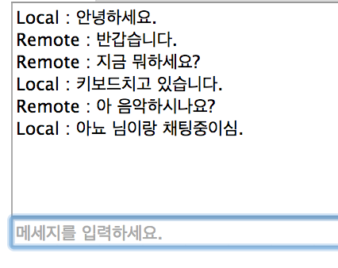

# 채팅 연결하기

영상을 연결함으로써 WebRTC의 PeerConnection을 통한 기본적인 MediaStream 통신을 확인하였습니다. 이제 하나 더 남은 WebRTC의 강력한 기능인 [DataChannel](http://www.w3.org/TR/webrtc/#peer-to-peer-data-api)을 맛보기 위한 기능을 추가합니다.

그 기능은 바로.

**채팅** 입니다 :-)

## 투두 목록
- DataChannel 생성하기
- DataChannel 연결하기
- 채팅메세지 보내기 / 표시하기

## DataChannel 생성하기
DataChannel 생성은 PeerConnection을 통해서 이뤄집니다. 이미 우리는 연결가능한 PeerConnection이 있기 때문에 간단하게 DataChannel을 생성할 수 있습니다.

``` javascript
function openDataChannel(pc_){
    console.log('try to open datachannel');
    try{
        dataChannel = pc_.createDataChannel(connectedRoom);
    }catch(e){
        console.log(e);
    }
    initDataChannel(dataChannel);
}

//datachannel은 기본적인 WebSocket api형태와 비슷합니다.
function initDataChannel(dc_){

  dc_.onerror = function(error_){
    console.log('datachannel error : '+error_);
  }

  dc_.onmessage = function(event_){
    console.log('received dc data : '+event_.data);
  }

  dc_.onopen = function(){
    console.log('dc is opened');
  }

  dc_.onclose = function(){
    console.log('dc is disconnected');
  }
}
```

## DataChannel 연결하기

DataChannel은 양쪽에서 모두 생성할 필요없이 한쪽에서 생성을 하면 반대쪽에서는 PeerConnection의 Event Callback으로 받게됩니다. 이를 처리하면 됩니다. 쉽죠잉? :-)

```javascript
...
pc.ondatachannel = function(event_){
  console.log('datachannel event -> '+event_);
  initDataChannel(event_.channel);
};
...
```

- 자 그럼 openDataChannel 호출은 어디서 이뤄지면 좋을까요? **퀴즈입니다**

## 채팅메세지 보내기 / 표시하기

이제 DataChannel은 연결될 것이기 때문에 메세지를 주고 받는 부분을 구현합니다. DataChannel로는 단순한 String교환도 가능하지만 Binary교환도 가능하다는 점 잊지 말아주세요 ;-)

```javascript

...
var chatArea, chatMsg;

$(document).ready(function(){
  ...
  chatArea = $('#chatArea');
  chatMsg = $('#chatMsg');
  ...
}
...
//textarea에 표시하기 위한 함수
function addChat(msg_){
  chatArea.append(msg_+'\n');
  chatArea[0].scrollTop = chatArea[0].scrollHeight;
}

...
dc_.onmessage = function(event_){
  console.log('received dc data : '+event_.data);
  addChat('Remote : '+event_.data);
}

dc_.onopen = function(){
  console.log('dc is opened');

  chatMsg.attr('disabled',false);

  chatMsg.keydown(function(event_){
    if(event_.keyCode == 13){
      addChat('Local : '+chatMsg.val());
      dc_.send(chatMsg.val());
      chatMsg.val('');
    }
  });
}
...

```

- 테스트를 진행하면 아래와 같이 잘 동작하는 것을 확인하실 수 있습니다.



- 채팅까지 완료가 되었다면 이제 진정한 [배포](SET_THE_PLAYGROUND.md#deploy)를 하실 시간입니다~

## Next
- [화면 이쁘게 꾸미기 & 질의응답](REMAINING.md)
