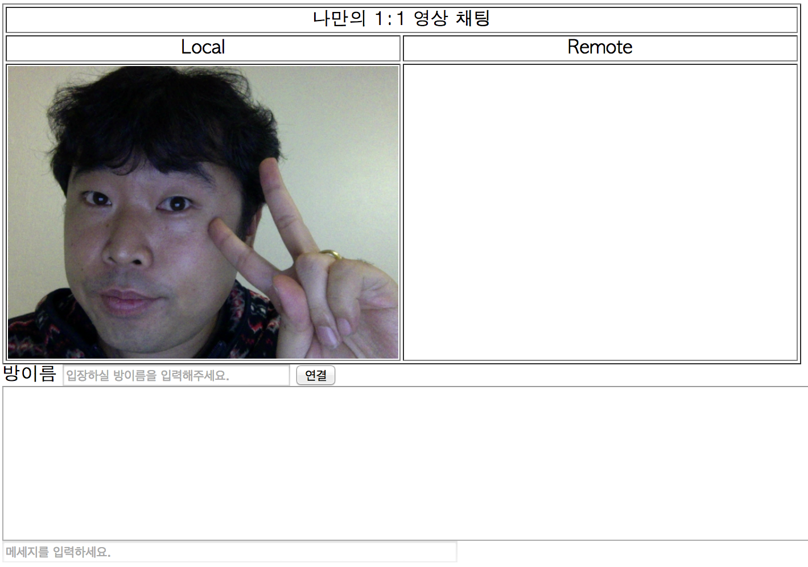

#내가 이렇게 생겼군
이번 페이지에서는 [GetUserMedia api](http://www.w3.org/TR/mediacapture-streams/)를 이용한 Media Input을 Video Tag에 연결합니다.

##투두 목록
- 내 PC의 Video Input Stream을 Video Tag에 연결

## getUserMedia api 호출.
- ```$(document).ready()```를 통해서 getUserMedia 함수를 호출합니다.

#### GetUserMedia
getUserMedia 함수는 아래의 형태를 가집니다.
```javascript
  navigator.getUserMedia(constraints, successCallback, errorCallback);
```

우리가 사용할 Chrome에서는 현재 prefix로 webkit이 붙어 있어 실제 호출은
```javascript
  navigator.webkitGetUserMedia(constraints, successCallback, errorCallback);
```

constraints에서는 얻어올 미디어의 형태를 정의할 수 있습니다.
```javascript
{
  audio : true, //오디오 입력을 가져옴.
  video : true //비디오 입력을 가져옴.
}

//또는 자세한 입력 형태를 정의할 수 있다.

{
  audio : true,
  video : { //최소 640x480 영상 입력을 가져온다.
    mandatory : {
      width : {min : 640},
      height : {min : 480}
    }
  }
}
```
constraints에 대한 자세한 내용은 [여기](http://www.w3.org/TR/mediacapture-streams/#idl-def-MediaStreamConstraints)에서 확인 가능합니다.

## index.html

우리는 이제 getUserMedia를 호출하는 코드를 삽입합니다.

``` javascript
var localStream;

...

$(document).ready(function(){
  openVideo();
}

...

function openVideo(){
  navigator.webkitGetUserMedia(
    {'audio':true, 'video':true}, //constraints
    function(stream_){    //successCallback
      localStream = stream_;
      //Chrome에서는 Stream을 바로 video src로 사용할 수 없습니다.
      $('#localVideo').attr('src', webkitURL.createObjectURL(stream_));  
    },
    function(err_){   //errorCallback
      console.log(err_)
    }
  );
}
...
```

## Local Test
- 해당 코드를 저장하고 [로컬 서버를 통해](SETUP_THE_PLAYGROUND.md#local) 확인합니다.
- getUserMedia api가 정상적으로 호출이되면 아래와 같이 크롬에서 연결에 대한 허용여부를 묻습니다.


- 허용을 누르시면 "짜짠!". 화면에 비친 **이쁜 내얼굴**을 보실 수 있습니다. :-)



## Next
- [Signaling Server 구성](SIGNALING.md)
