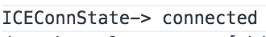

# PeerConnection 연결하기.
이 곳이 결국 WebRTC의 핵심 하이라이트 파트입니다!

##투두 목록
- PeerConnection 생성하기
- Offer / Answer
- ice? ICE!

## PeerConnection 생성하기
상대방이 입장했다는 것을 인지 했다면 이제 연결을 해야합니다.

PeerConnection은 생성 시점은.
- 상대방이 들어온 경우
- 상대방이 Offer를 보내온 경우

### index.html

- 상대방이 들어오는 것을 감지하기 위한 코드를 삽입합니다.

``` javascript
...
gaeSocket.onmessage = parseSignal;
...

function parseSignal(signal_){
  var signalObj  = JSON.parse(signal_.data);
  if(signalObj.m != localTimeStamp){
    console.log('received signal : '+ signal_.data);
    if(signalObj.type == 'hello'){
      console.log('누구 오셨어용?');
    }
  }
}
...

```

- 상대방이 입장했다는 것을 인지 했다면 상대방과 연결하기 위한 [PeerConnection](http://www.w3.org/TR/webrtc/#peer-to-peer-connections)을 생성합니다.

``` javascript
var serverConfig = {'iceServers' : [{'url':'stun:stun.l.google.com:19302'}]}; //Google의 Public STUN Server를 사용

var peerConnection;

function createPeerConnection(){
  //Chrome에서는 prefix로 webkit이 붙어 있습니다.
  var pc = new window.webkitRTCPeerConnection(serverConfig);
  return pc;
}

...
if(signalObj.type == 'hello'){
  peerConnection = createPeerConnection();  //상대방이 들어온 경우에
}
...
```

## Offer / Answer

여기서 다루는 Signal 순서는 간단하게 3단계로 이뤄집니다.
- hello를 보냄
- hello를 받으면 offer를 보냄
- offer를 받으면 answer를 보냄

Offer / Answer는 JSEP - Javascript Session Establishment Protocol에 따릅니다.
그래서 영상통화 요청을 신청하는 것이 Offer 이에 응답하는 것을 Answer로 생각하면 됩니다.

이때 Offer와 Answer 시에 주고 받는 방식이 SDP - Session Description Protocol입니다. Session Desciption은 각 Peer가 모두 생성하게되면 PeerConnection객체에 Local/Remote 두 가지를 설정하면 기본적인 연결 정보설정이 되는 것입니다.

### Offer 하기
상대방으로 부터 hello를 받은 시점에 offer를 보내도록 설정합니다.
offer를 보내기 위해서는 우선 PeerConnection으로 부터 SD를 생성해야합니다.

```javascript
...
if(signalObj.type == 'hello'){
  ...
  peerConnection.createOffer(function(sd_){
    //생성된 Session Description을 상대방에게 전송합니다.
    sendSignal({
      type:'offer',
      sdp:sd_.sdp,
      m:localTimeStamp
    });

    peerConnection.setLocalDescription(sd_);  //전송한 SD를 PeerConnection 객체의 Local로 설정합니다.
  });
  ...
}
...
```

### Answer 하기
방에 입장하여 hello를 전송하였다가 상대방으로 부터 Offer를 받게되면 그때 PeerConnection을 생성하여
Answer를 합니다.

```javascript
...
}else if(signalObj.type == 'offer'){
  peerConnection = createPeerConnection();

  //offer를 통해 건내 받은 sd를 PeerConnection의 Remote로 설정합니다.
  peerConnection.setRemoteDescription(new RTCSessionDescription(signalObj));

  //Answer를 위한 SD를 생성합니다.
  peerConnection.createAnswer(function(sd_){
    //생성된 SD로 answer를 상대방에게 전달합니다.
    sendSignal({
      type:'answer',
      sdp:sd_.sdp,
      m:localTimeStamp
    });

    //생성된 SD를 PeerConnection의 Local로 설정함으로써 이 PeerConnection은 양쪽을 모두 갖게 되었습니다.
    peerConnection.setLocalDescription(sd_);
  });
}
...
```

### Answer 처리하기
offer를 보낸 Peer가 상대방으로부터 answer를 받게되면 그제서야 상대방의 SD를 자신의 PeerConnection에 Remote로 설정함으로써 양쪽 SD 설정을 마치게 됩니다.

```javascript
...
}else if(signalObj.type == 'answer'){
  peerConnection.setRemoteDescription(new RTCSessionDescription(signalObj));
}
...
```

- 그럼 이것이 연결이 된 것 일까요?

## ice? ICE!
양쪽의 PeerConnection 객체가 SDP를 통해 정보를 교환하였다고 실제 연결이 이뤄지지는 않습니다. SDP는 단지 상대방과 나의 Peer의 Media 정보에 대한 교환한 것이지 실제 연결을 위한 주소지 정보는 이뤄지지 않았습니다.

실제 주소지 정보는 바로 ICE - Interactive Connectivity Establishment를 통해서 이뤄집니다.

ICE는 PeerConnection을 생성할때 입력한 Server Config를 통해서 생성이 됩니다.

기본적으로 세가지 타입의 ICE 후보가 생성이 되며
 - Direct : Direct 연결을 위한 현재 자신의 IP 주소
 - Reflexive : Public에서 접근 가능한 자신의 IP 주소 (자신이 NAT가 아닌 Public 망에 존재하는 경우 Direct 정보와 동일)
 - Relay : P2P가 불가능한 경우를 대비해 TURN 서버가 발행하는 중계 주소

이 ICE 후보자 정보를 상대방에게 전달하여 자신에게 접근할 수 있도록 합니다.

ICE 후보자 정보는 PeerConnection 객체의 Event Callback으로 생성되기 때문에 이를 구현해야합니다.

```javascript
function createPeerConnection(){
  ...
  pc.onicecandidate = function(event_){
    if(event.candidate){
      sendSignal({
        type:'candidate',
        m:localTimeStamp,
        candidate:event_.candidate.candidate
      });
    }
  };
  ...
}
```

상대방으로 부터 받은 ICE 후보자 정보는 자신의 PeerConnection 객체에 추가합니다.

```javascript
...
}else if(signalObj.type == 'candidate'){
  if(peerConnection){
    peerConnection.addIceCandidate(new RTCIceCandidate({candidate:signalObj.candidate}));
  }
}
...
```

ICE가 정상적으로 이뤄지고 있는지를 확인하려면 PeerConnection에서 발생하는 state change event callback을 통해서 확인할 수 있습니다.

```javascript
...
pc.oniceconnectionstatechange = function(event_){
  console.log('[ICEConnState->'+event_.target.iceConnectionState);
};
...
```

- 로컬서버로 테스트를 해보면 아래와 같은 메세지를 얻으실 수 있습니다.



ice connection state에서 connected 는 실제 연결이 확인이 된 상태이고 completed는 후보자 수집이 종료되었다는 상태입니다.

자세한 내용은 [여기](http://www.w3.org/TR/webrtc/#rtciceconnectionstate-enum)에서 확인하실 수 있습니다.

자 그럼 Peer간 연결이 되었습니다. 이제 영상을 넘겨 봅시다~

## Next

- [Streaming 연결하기](STREAMING.md)
