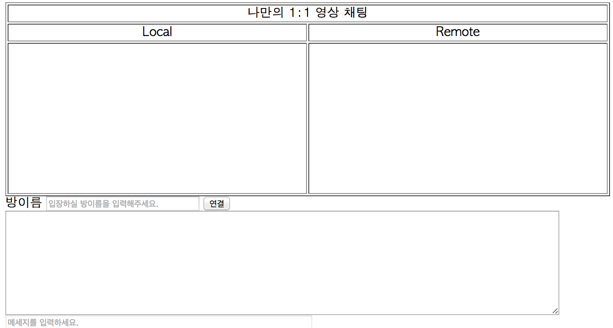

#Setup the playground.
1:1 영상채팅을 만들기 위한 기본 환경 설정을 합니다.

## 투두 목록
- [Google Appengine Project 생성](#first)
- [index.html 생성](#index)
- [Local에서 확인](#local)
- [GAE Application Deploy](#deploy)


## <a name="first"></a>Google Appengine Project 생성

### 시작전에 확인 해야할 것
- JDK 가 설치되어 있는지.
- Google Appengine SDK가 설치되어 있는지.
- Eclipse가 설치되어 있는지.
- Eclipse용 GAE Plugin이 설치되어 있는지.

### 할일
 - New>Web Application Project를 통해서 생성
 - GWT는 설치 안함.
 - Sample 코드 생성 안함.
 - war/web.xml에 welcome file설정을 web-app 하위에 설정함.

 ```xml
<welcome-file-list>
        <welcome-file>index.html</welcome-file>
</welcome-file-list>
 ```

 - 끝!

## <a name="index"></a>index.html 생성
index.html을 war 폴더 하위에 생성.

Header에 jQuery를 추가 (local에 파일을 두고 있다면 로컬을 사용. jQuery 버전은 자기 마음데로~)

```html
<script src="//ajax.googleapis.com/ajax/libs/jquery/2.1.1/jquery.min.js"></script>
```

body에 아래의 형태로 모양을 꾸밉니다. **이쁘게 만드는 것은 여러분의 몫!**

```html
<!--화상 테이블-->
<table width="100%">
    <tr>
        <td colspan="2" align="center">나만의 1:1 영상 채팅</td>
    </tr>
    <tr>
        <td align="center">Local</td>
        <td align="center">Remote</td>
    </tr>
    <tr>
        <td width="50%"><video width="100%" id="localVideo" autoplay></video></td>
        <td width="50%"><video width="100%" id="remoteVideo" autoplay></video></td>
    </tr>
</table>

<!--방 이름 입력 & 연결 버튼-->
<div>
    방이름
    <input type="text" id="room" style="width:200px;" placeholder="입장하실 방이름을 입력해주세요.">
    <input type="button" id="connectBtn" value="연결">
</div>

<!--채팅창-->
<div>
    <textarea rows="10" cols="100" id="chatArea" readonly></textarea>
</div>
<div>
    <input type="text" id="chatMsg" style="width:400px;" placeholder="메세지를 입력하세요." disabled>
</div>
```

## <a name="local"></a>Local에서 확인

- Run 을 수행함.
- Browser에서 http://localhost:8888 열어봄.

- 이런 화면이 나오면 준비 끝!

## <a name="deploy"></a>GAE Application Deploy

- war/appengine-web.xml에 deploy할 application id 와 버전을 설정하여 배포!

``` html
<application>{application-id}</application>
<version>{versioin-ni\o}</version>
```

- application id 는 http://console.developers.google.com 에서 생성한 자신의 application 창에서 확인 가능합니다.
- 버전도 콘솔의 해당 프로젝트 안에서 확인 가능합니다.
- 배포이후에는 http://{application-id}.appspot.com 에 로컬에서 확인한 화면이 나오면 정상적으로 완료된 것입니다.

##Next

- [내가 이렇게 생겼군.](GETUSERMEDIA.md)
