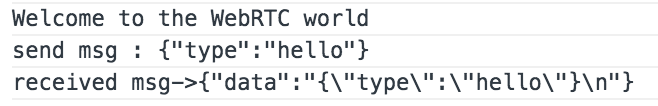
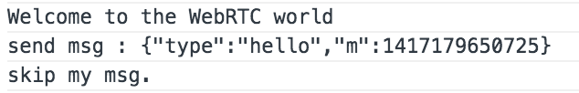

#Signaling Server 구성.
WebRTC에서 Peer간의 연결 초기 과정에 관여하게되는 Signal Server를 구성합니다. 여기에서는 [Google Appengine의 Channel API](https://cloud.google.com/appengine/docs/java/channel/)를 사용합니다.

##투두 목록
- Channel API Token을 생성하는 Servlet 생성
- Browser에서 Channel 연결
- Channel로 메세지 전송
- 방이름을 입력 받아서 연결

## Channel API Token을 생성하는 Servlet 생성

### SignalServlet Class를 생성.
- Channel API의 Token을 Return 하기위해 GET으로 접근 가능하도록 Servlet에 doGet 함수 구현.

```java
package ...
import ...

public class SignalServlet extends HttpServlet {

    @Override
    protected void doGet(HttpServletRequest req, HttpServletResponse resp) throws ServletException, IOException {
        String room = req.getParameter("room"); //room 값을 가져옴.

        JSONObject retObj = new JSONObject();
        String result = "fail";

        if(room != null && room.trim().length() > 0){
            ChannelService channelService = ChannelServiceFactory.getChannelService();

            //room에 해당하는 channel을 생성한다.
            String token = channelService.createChannel(room);  //room 값의 Channel이 이미 생성되어 있다면 기존의 Token을 반환한다.

            result = "success";
            try {
                retObj.put("room", room);
                retObj.put("token", token);
            } catch (JSONException e) {
                e.printStackTrace();
            }
        }

        try {
            retObj.put("result", result);
        } catch (JSONException e) {
            e.printStackTrace();
        }

        resp.getWriter().write(retObj.toString());
    }

}


```

### web.xml 설정
- Servlet을 생성하였으니 web.xml에 url pattern mapping을 한다.

```xml
<servlet>
    <servlet-name>SignalServlet</servlet-name>
    <servlet-class>package.name.SignalServlet</servlet-class>
</servlet>
<servlet-mapping>
    <servlet-name>SignalServlet</servlet-name>
    <url-pattern>/signal</url-pattern>
</servlet-mapping>
```
- 이제 /signal 요청에 대하여 SignalServlet이 호출된다.
- [로컬 서버](SETUP_THE_PLAYGROUND.md#local)를 실행시키고 http://localhost:8888/signal에 접근하면 웃기게도 fail이라고 출력되면 정상적으로 Servlet 연결 완료!

## Browser에서 Channel 연결

### channel api 로딩
- browser에서 Channel API를 사용하기 위해서는 아래와 같이 script를 로딩해야한다. header에 추가하자.

```html
<script type="text/javascript" src="/_ah/channel/jsapi"></script>
```

### Channel 객체 초기화
- Channel 객체를 초기화 하기위해서는 GAE에서 생성되는 Token이 필요하다.
- ajax를 통해 상단에서 생성했던 Signal Servlet을 통해 받아오자.

```javascript
...
var gaeChannel, gaeSocket;
var connectedRoom;
...
function openChannel(){
  $.ajax({
      url:'/signal',
      type:'get',
      dataType:'json',
      data:{
          room:'TEST' //TEST란 방이름으로 생성.
      },
      success:function(resp){
          if(resp.result == 'success'){
              connectedRoom = resp.room;  //연결된 방을 저장.
              gaeChannel = new goog.appengine.Channel(resp.token);  //서버로부터 넘겨받은 token으로 초기화.
              gaeSocket = gaeChannel.open();
              gaeSocket.onopen = function(){
                  console.log("Welcome to the WebRTC world");
              }
              gaeSocket.onmessage = function(data_){
                  console.log("received msg->"+JSON.stringify(data_));
              }
          }else{
              alert('연결실패');
          }
      }
  });
}

$(document).ready(function(){
  ...
  openChannel();
  ...  
});
```

- 위와 같이 넣고 [로컬 서버](SETUP_THE_PLAYGROUND.md#local)로 다시 실행시켜 http://localhost:8888 에 접근하면
콘솔로그에 정상적이라면 웰컴메세지가 출력된다.

## Channel로 메세지 전송

- 이제 Channel에 메세지를 전송하는 API를 서버에 만들어보자.

### Signal Servlet
- 우선 서버에서 Channel에 메세지를 전달할 POST를 구현한다.
- 아래의 함수를 기존에 생성한 SignalServlet에 추가한다.

```java
@Override
protected void doPost(HttpServletRequest req, HttpServletResponse resp) throws ServletException, IOException {

    String room = req.getParameter("room"); //메세지를 받을 채널의 room 명
    String msg = req.getParameter("msg"); //msg

    JSONObject retObj = new JSONObject();
    String result = "fail";

    if(room != null && room.trim().length() > 0){
        ChannelService channelService = ChannelServiceFactory.getChannelService();
        ChannelMessage message = new ChannelMessage(room, msg);
        channelService.sendMessage(message);

        result = "success";
    }

    try {
        retObj.put("result", result);
    } catch (JSONException e) {
        e.printStackTrace();
    }

    resp.getWriter().write(retObj.toString());
}
```

### index.html
- 서버에서 POST가 추가되었기 때문에 browser에서 호출할 함수를 구현한다.

```javascript
function sendSignal(msgObj_){ //signal을 json으로 주고 받을 예정.
    var msg = JSON.stringify(msgObj_);
    console.log('send msg : '+msg);
    $.ajax({
        url:'/signal',
        type:'post',
        dataType:'json',
        data:{
            room: connectedRoom,
            msg:msg
        },
        success:function(resp){
        }
    });
}

//gaeSocket이 open되었을때 hello message를 보내보자.
...
gaeSocket.onopen = function(){
  console.log("Welcome to the WebRTC world");
  sendSignal({type:'hello'});
}
...
```

- 이제 크롬브라우저에서 개발자 콘솔을 열고 http://localhost:8888 에 접근하면 아래와 같이 메세지를 확인할 수 있다.



- 하지만 여기서 문제는 내가 보낸 메세지를 내가 받아서 처리하면 안된다. 그래서 나를 구분하기 위한 구분자를 하나 생성해서 메세지에 포함시킨다.

``` javascript
...
var localTimeStamp; //단순하게 페이지 열린시점의 timestamp :-)
...

$(document).ready(function(){
...
localTimeStamp = new Date().getTime();  
...
}  

...
gaeSocket.onopen = function(){
  console.log("Welcome to the WebRTC world");
  sendSignal({type:'hello', m:localTimeStamp});
}

gaeSocket.onmessage = function(data_){
  var dataObj = JSON.parse(data_.data);
  if(dataObj.m != localTimeStamp){
      console.log("received msg->"+JSON.stringify(data_));
  }else{
      console.log("skip my msg.");
  }
}
...
```

- 결과는...



- 끝!?....one more thing.

## 방이름을 입력 받아서 연결
- 위에서는 임시로 방이름이 ```TEST``` 였는데 이것을 입력받아 '연결'버튼을 눌렸을 때 연결을 시작하도록 바꿔보세요.

## NEXT
- [PeerConnection 연결하기](PEERCONNECTION.md)
