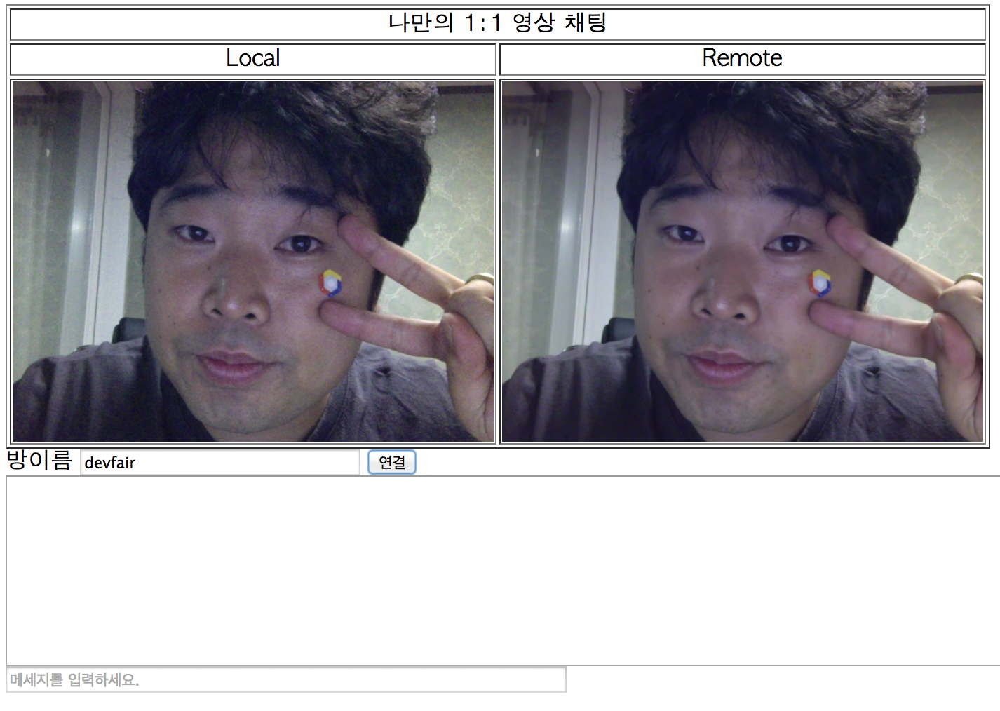

# Streaming 연결하기

이제 로컬서버에서 http://localhost:8888 에 접속해서 방이름 넣고 연결을 하면 각 브라우저가 연결이 되는 것 까지 완료를 하였습니다. 그럼 이제는 이전에 실습한 Media를 PeerConnection을 통해 넘겨주기만 하면 됩니다.

##투두 목록
- localStream을 PeerConnection에 삽입
- 상대 MediaStream을 나의 Video Tag에 삽입

## localStream을 PeerConnection에 삽입

[앞의 실습](GETUSERMEDIA.md)에서 getUserMedia api를 통해 받은 MediaStream을 localStream 변수에 할당한 것을 기억하실 겁니다. 이제 이것을 PeerConnection에 추가만 하면 됩니다.

``` javascript
...
function createPeerConnection(){
...
  if(localStream) pc.addStream(localStream);  //localStream을 받아 놓았으면 PeerConnection에 추가!!
...  
}
...

```

## 상대 MediaStream을 나의 Video Tag에 삽입

상대방의 MediaStream은 PeerConnection이 ICE를 마치고 실제 연결이 완성이 되면 PeerConnection의 Event callback을 통해서 전달 받게 됩니다. 그래서 이부분에서 Remote화면을 보여줄 Video Tag에 설정만 하면 됩니다.

``` javascript
...
function createPeerConnection(){
...
  pc.onaddstream = function(event_){
    $('#remoteVideo').attr('src', webkitURL.createObjectURL(event_.stream));
  };
...  
```

## 영상통화 Test!

이제 로컬서버에서 http://localhost:8888 을 두개의 다른 탭에서 열어 같은 방이름을 넣고 연결을 하면!?



**두둥!** 하고 연결된 화면을 보실 수 있습니다. **화면을 두개 붙인 것이 아닙니다 :-)**

간혹 로컬서버에서는 시간이 걸리는 경우가 있는데 이것은 로컬서버에서 제공되는 Channel API가 실제 서비스에서 사용되는 형태가 아닌 타임딜레이를 가지고 폴링하는 메세지큐형태이기 때문입니다 :-) - 실섭에서는 빠름빠름 ㅋ

## 다른 친구와 통화해보기

- 만든 영상통화 서비스가 다른 친구들과 해보기 위해서는 로컬서버로는 쉽지 않죠? 이제 [배포](SET_THE_PLAYGROUND.md#deploy)를 다시 해보실 시간입니다~

- 어라 몇몇의 경우에는 친구들과 연결이 되지 않는 경우가 발생합니다. 왜그럴까요? **퀴즈입니다**

## NEXT

- [채팅 연결하기](DATACHANNEL.md)
